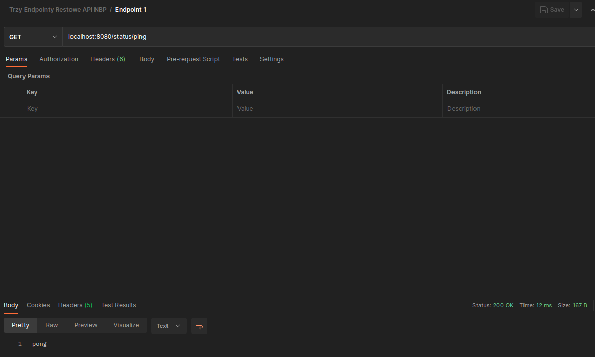
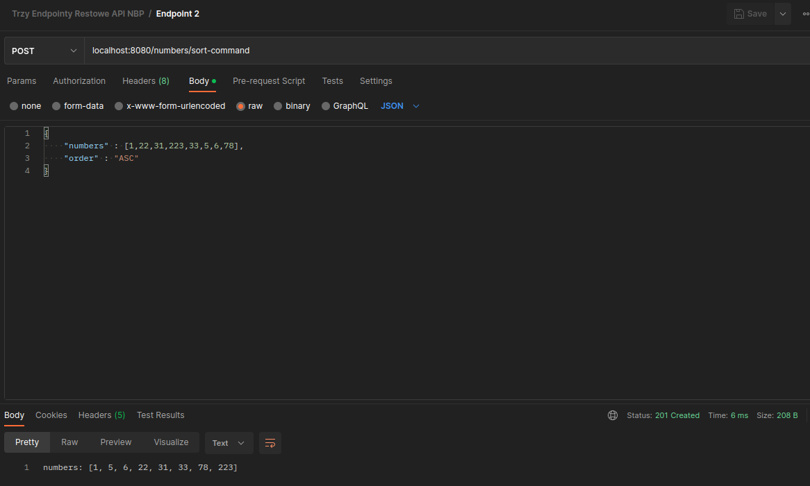
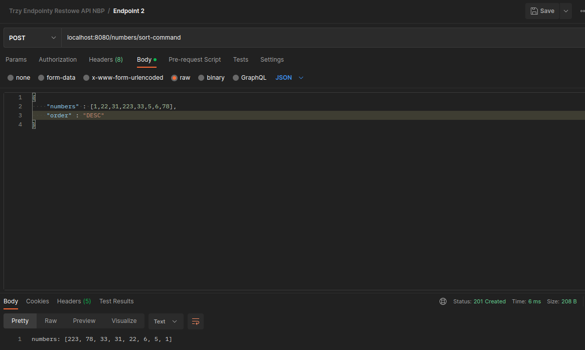
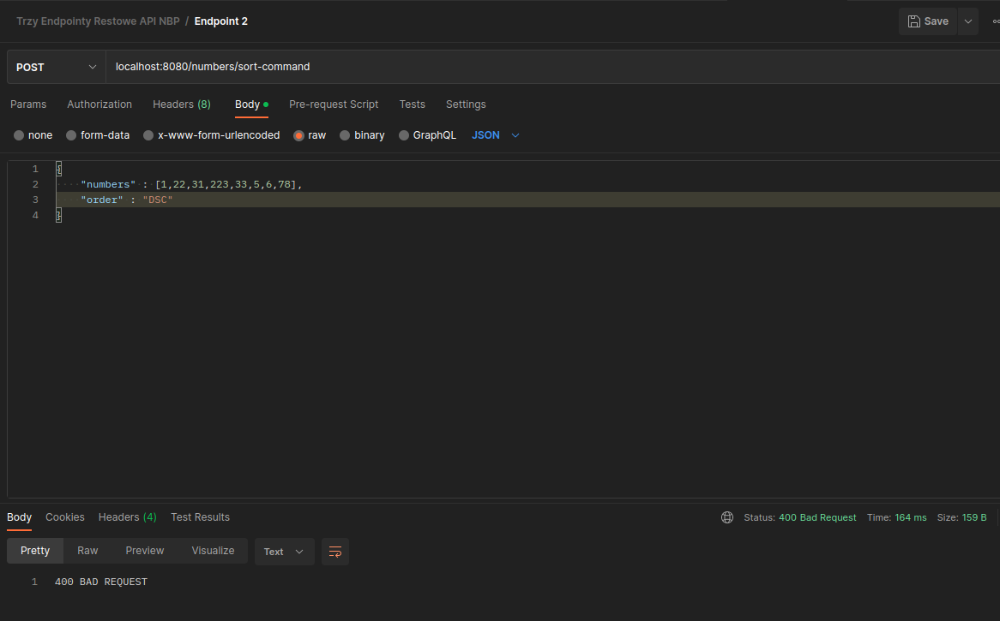
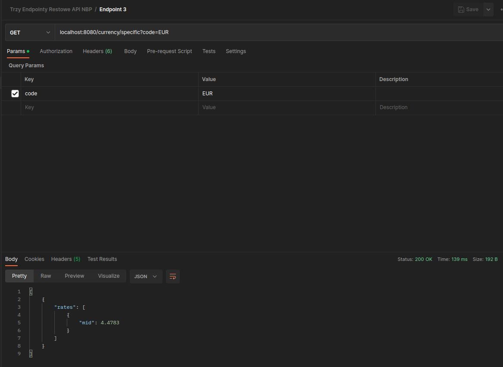

<h1>Trzy Endpointy Restowe - Komunikacja z API NBP</h1>

<strong>Zadanie 1. Aplikacja RESTowa – Java, Spring, Gradle</strong>

Celem zadania jest wykorzystanie frameworka spring oraz gradle lub maven do stworzenia aplikacji
obsługującej 3 endpointy restowe.

<strong>Endpoint 1.</strong> GET na ścieżce /status/ping nie przyjmujący żadnych parametrów, który odpowiada na
sztywno stringiem „pong”

<strong>Endpoint 2.</strong> POST na ścieżce /numbers/sort-command umożliwiający sortowanie liczb. Endpoint
przyjmuje jako body obiekt zawierający listę liczb do posortowania oraz informacje czy sortowanie
ma być rosnące czy malejące. Jako odpowiedź zwraca odpowiedni kod http oraz obiekt zawierający
posortowaną listę liczb

Przykładowe body: 
{ 
&emsp;&emsp;numbers: [1, 5, 3, 9, 7], 
&emsp;&emsp;order: ”ASC” 
}  
Odpowiedź: 
{ 
&emsp;&emsp;numbers: [1, 3, 5, 7, 9] 
}  
Uwagi: 
- pole numbers może być puste lub może przyjąć wartość null 
- pole order przyjmuje wartości ASC oraz DESC 
- w przypadku błędnych danych aplikacja powinna zwrócić odpowiedni kod http  

<strong>Endpoint 3.</strong> POST na ścieżce /currencies/get-current-currency-value-command umożliwiający
pobranie z NBP aktualny kurs danej waluty. Endpoint przyjmuje jako body obiekt zawierający kod
waluty. Jako odpowiedź zwraca odpowiedni kod http oraz obiekt zawierający informacje o
aktualnym kursie waluty.

Przykładowe body: 
{ 
&emsp;&emsp;currency: ”EUR” 
}  
Odpowiedź: 
{ 
&emsp;&emsp;value: 4.2954 
}  
Uwagi:

- zadaniem aplikacji jest połączyć się z NBP po API dostępnym pod adresem http://api.nbp.pl/ (dla
  ułatwienia chodzi o konkretny endpoint pod adresem http://api.nbp.pl/api/exchangerates/tables/A?
  format=json). Następnie pobrać kurs waluty zgodnie z parametrem z żądania i zwrócić jego wartość
- w przypadku podania nieistniejącej waluty należy zwrócić odpowiedni kod oraz wyjątek

## Przykładowe screeny odpowiedzi każdego z endpointów z Postmana
 
<h4><strong>Endpoint 1.</strong></h4>
 

<h4><strong>Endpoint 2.</strong></h4>
 

<h4><strong>Endpoint 3.</strong></h4>
 
